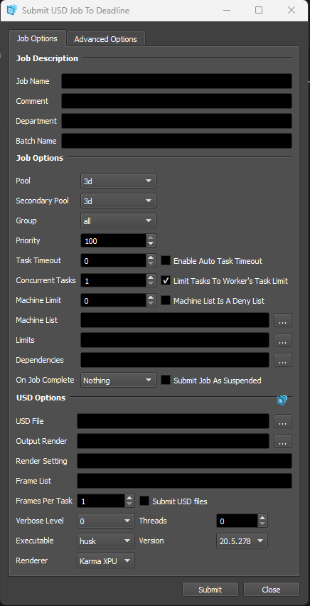
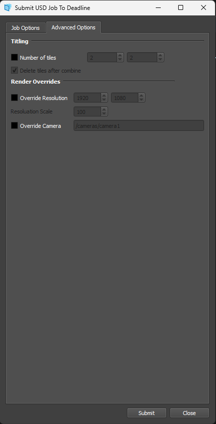
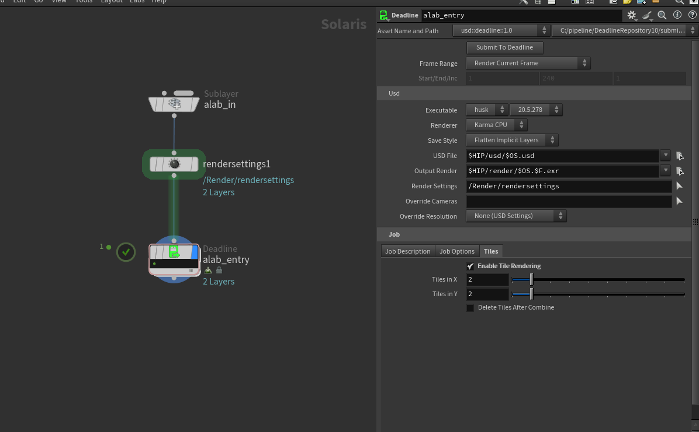
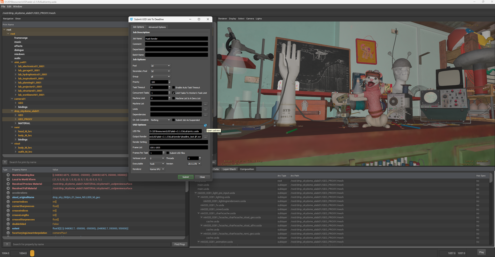

# USD Render Deadline Plugin

The USD Render Deadline Plugin is a versatile tool designed to integrate the power of USD (Universal Scene Description) with Deadline, a render management system. 

This plugin is DCC agnostic, offering scalability and the potential for extensions through [renderer.json](./plugins/USD/renderer.json). The plugin is setup for `Husk`
It supports advanced features like render overrides, tiled rendering, utilizes OpenImageIO (OIIO) to combine individual frame tiles into the final output, and usdview in submitter.

 

## Features

- **Render Overrides**: This plugin enables users to apply render overrides like `rendersettings`, `cameras`, and `resoultion` to their USD scenes, allowing for dynamic adjustments to the multi shot rendering process without modifying the original scene files.

- **Tiled Rendering**: Take advantage of tiled rendering for increased efficiency. The plugin automatically divides each frame into smaller tiles for rendering, utilizing the available computational resources more effectively.

- **Husk Integration**: The plugin is built on top of Husk, providing a solid foundation for scalable and efficient rendering. Husk's distributed architecture allows for easy scaling across a network of machines.

- **Houdini Submitter LOP Node**: Houdini Deadline LOP node based on PDG to make the submission easy from houdini.

- **Extensibility**: The USD Render Deadline Plugin has been designed with extensibility by adding any extra arguments or new renderer to [renderer.json](./plugins/USD/renderer.json). 
The modular architecture allows for future integration of additional features and functionalities.

- **OpenImageIO (OIIO) Integration**: The plugin employs OpenImageIO to seamlessly combine the individual tiles of a frame into the final output, ensuring a smooth and accurate rendering process.

- **usdview**: usdview to view the usd file through deadline submitter.

## Installation

1. Download the latest release of the USD Render Deadline Plugin.

2. Extract the downloaded archive to a location on your system.

3. Copy the `plugins/USD` directory to the `{RepositoryRoot}/plugins` directory of your Deadline Repository.
4. Copy the `USDSubmission.py` file to the `{RepositoryRoot}/scripts/Submission` directory of your Deadline Repository.
5. From `Deadline Monitor: Tools >> Configer Script Menus` move/rename `USDSubmission` as you like. (Needs deadline credentials).
6. For tile render by default is set houdini `hoiiotool` tool, in case you custom tool, you need to download [oiio](https://distribute.openpype.io/thirdparty/oiio_tools-2.3.10-windows.zip) and add `OIIO=/path/to/oiio/dir` to system variable.
7. To add Houdini submitter, update [deadline.json](./deadline.json) with `{RepositoryRoot}/submission/USD/Main` and add it to houdini packages, or set `HOUDINI_PACKAGE_DIR` with the json file directory.

## Usage

1. Launch Deadline Monitor and open `submit >> <your plugin name>`.

2. Configure the render settings, including render overrides and tiled rendering options.

3. Submit the job to the Deadline Render Farm.

4. Monitor the job's progress through the Deadline Monitor interface.

### Inside Houdini
1. Drop LOP Deadline node 
2. Set your parameters and `Submit To Deadline`

## Contributing

We welcome contributions to enhance the USD Render Deadline Plugin. To contribute:

1. Fork the repository and clone it to your local machine.

2. Create a new branch for your feature or enhancement.

3. Implement your changes, following the existing code structure and guidelines.

4. Test your changes thoroughly.

5. Commit and push your changes to your fork.

6. Submit a pull request to the main repository, explaining the changes and the benefits they bring.

## License

The USD Render Deadline Plugin is released under the [MIT License](./LICENSE).

---

Thank you for using the USD Render Deadline Plugin! We hope it streamlines your rendering workflow and provides you with advanced capabilities for rendering USD scenes using Deadline.